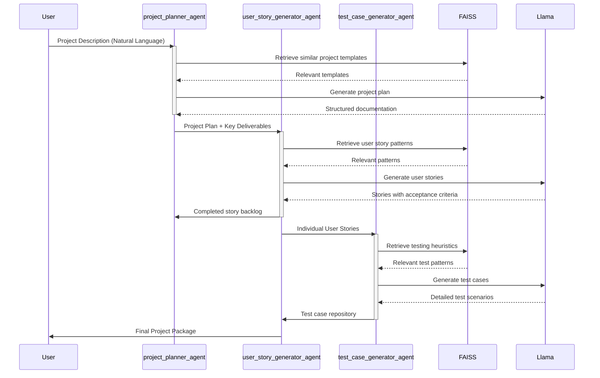

# project-planner-agentic-ai

Generate project delivery plan, generate user stories and relevant test cases.

## Sequence Diagram

```mermaid
sequenceDiagram
    participant User
    participant P_Planner as project_planner_agent
    participant StoryGen as user_story_generator_agent
    participant TestGen as test_case_generator_agent

    User->>P_Planner: Project Description (Natural Language)
    activate P_Planner
    P_Planner->>FAISS: Retrieve similar project templates
    FAISS-->>P_Planner: Relevant templates
    P_Planner->>Llama: Generate project plan
    Llama-->>P_Planner: Structured documentation
    %% P_Planner->>User: Approval Request
    deactivate P_Planner

    %% User->>P_Planner: Approval Confirmation
    P_Planner->>StoryGen: Project Plan + Key Deliverables
    activate StoryGen
    StoryGen->>FAISS: Retrieve user story patterns
    FAISS-->>StoryGen: Relevant patterns
    StoryGen->>Llama: Generate user stories
    Llama-->>StoryGen: Stories with acceptance criteria
    StoryGen->>P_Planner: Completed story backlog
    deactivate StoryGen

    StoryGen->>TestGen: Individual User Stories
    activate TestGen
    TestGen->>FAISS: Retrieve testing heuristics
    FAISS-->>TestGen: Relevant test patterns
    TestGen->>Llama: Generate test cases
    Llama-->>TestGen: Detailed test scenarios
    TestGen->>StoryGen: Test case repository
    deactivate TestGen

    StoryGen->>User: Final Project Package

```